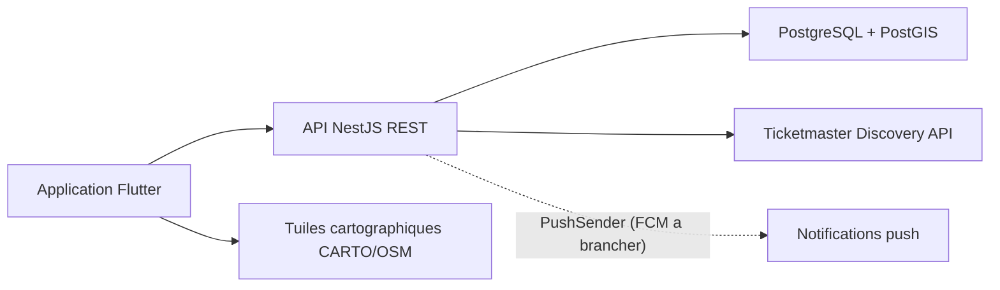

# Architecture LiveAround

## Vue d'ensemble

LiveAround suit une architecture backend-for-mobile :

## Application mobile (Flutter)

Organisation en couches sous `apps/mobile/lib/src/` :

| Couche | Contenu | Role |
|---|---|---|
| `domain/` | Concert, ConcertFilters, UserProfile, AppNotification, FrenchCity | modeles metier immuables, sans dependance technique |
| `data/` | repositories (interfaces + implementations API et mock), stockage de session, service de localisation | acces aux donnees ; l'implementation API gere jetons, renouvellement sur 401 et replis |
| `features/` | un dossier par ecran (auth, discovery, favorites, concert, notifications, profile, home, map) | UI + controleurs d'etat (`ChangeNotifier`), ex. `DiscoveryController` (filtres, pagination, localisation) |
| `theme/`, `config/` | theme Material 3, configuration compile-time (`--dart-define`) | apparence et parametrage |

Responsabilites cles : consentement de localisation avec alternative ville manuelle, session JWT restauree au demarrage et renouvelee automatiquement (refresh token), replis mock pour la demonstration hors ligne (mode demo explicite).

## API (NestJS)

Un module par domaine sous `apps/api/src/` :

| Module | Role |
|---|---|
| `auth/` | inscription/connexion, JWT 7 j + refresh rotatif 90 j (hashe en base), changement/reinitialisation de mot de passe, guards de session |
| `users/` | profil, preferences (genres, rayon, opt-in alertes), favoris, derniere position de recherche, suppression de compte (RGPD) |
| `concerts/` | recherche paginee via Ticketmaster (mapping des genres FR), caches memoire TTL/LRU, **ConcertStore** : ingestion PostGIS et recherche geospatiale de repli, signalements |
| `notifications/` | balayage periodique croisant nouveaux concerts et preferences, regle anti-spam (3/24 h), centre d'alertes, historisation des clics, abstraction `PushSender` |
| `database/` | pool PostgreSQL, **migrations versionnees** (`migrations.ts`, table `schema_migrations`), detection PostGIS |
| `common/` | utilitaires transverses (cache TTL/LRU) |

Transverse : validation DTO globale (whitelist), rate limiting, helmet, CORS liste blanche, Swagger sur `/docs`.

## Flux de donnees concerts

1. Le mobile envoie position (GPS ou ville) + filtres + page.
2. L'API complete avec les preferences du compte (genres) si aucun filtre explicite.
3. Source primaire : Ticketmaster (cache memoire 2 min par zone/filtres/page) ; chaque reponse est **ingeree en tache de fond** dans PostGIS (upsert salles + concerts).
4. Replis : cache PostGIS (`ST_DWithin`, tri par distance) si Ticketmaster est indisponible, puis donnees de demonstration.
5. Purge automatique des concerts passes.

## Flux notification (implemente)

1. L'ingestion horodate les nouveaux concerts.
2. Toutes les 15 minutes, le balayage croise ces concerts avec les utilisateurs **opt-in** : genres preferes, rayon favori, derniere position de recherche.
3. Regle anti-spam : 3 alertes max par utilisateur par 24 h, jamais deux fois le meme concert.
4. L'alerte est persistee (consultable in-app via la cloche) et transmise au `PushSender` — l'implementation FCM est le seul maillon restant a brancher.
5. Les clics sont historises pour mesurer la pertinence.

## Base de donnees

Tables : `users`, `user_refresh_tokens`, `password_reset_codes`, `venues` (+ index GIST), `concerts`, `user_concert_favorites`, `user_notifications`, `concert_reports`, `schema_migrations`. Le schema evolue exclusivement par migrations versionnees appliquees au demarrage ; les migrations geo sont differees si PostGIS est absent (fonctionnement degrade sans fonctionnalites geo).

## Documentation liee

[Frameworks et paradigmes](frameworks-paradigmes.md) · [Securite](securite.md) · [Qualite et performance](qualite-performance.md) · [CI](integration-continue.md) · [CD](deploiement-continu.md) · [Supervision](supervision.md)
