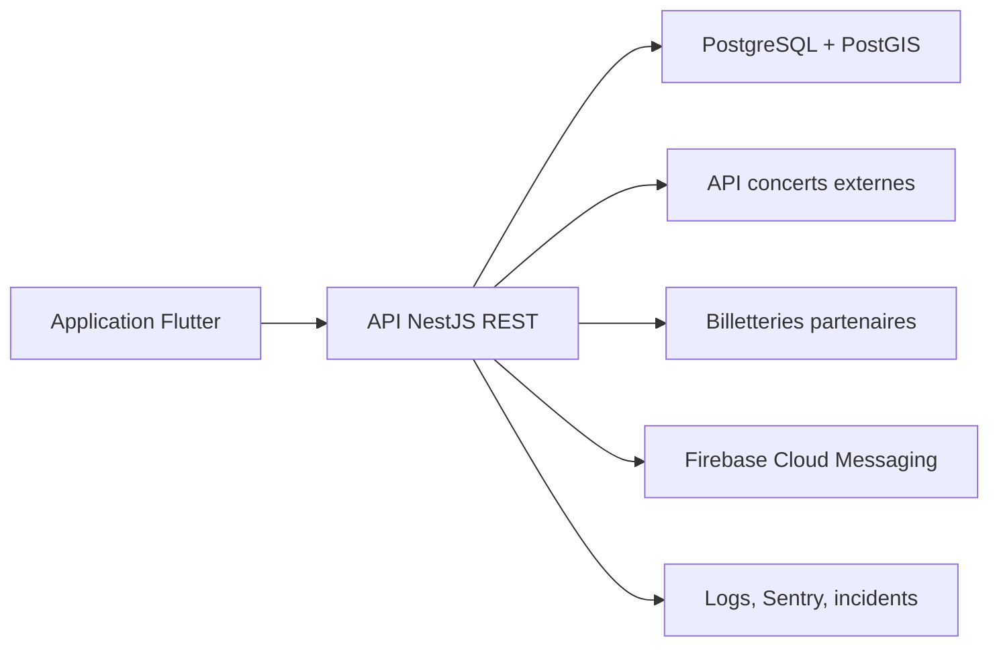

# Architecture LiveAround

## Vue d'ensemble

LiveAround suit une architecture backend-for-mobile :

## Responsabilites

### Application mobile

- Gerer l'experience utilisateur.
- Demander le consentement de localisation.
- Proposer une ville manuelle si l'utilisateur refuse le GPS.
- Afficher concerts, filtres, favoris et fiche detaillee.
- Gerer un profil mobile local rattache a un compte API.
- Recevoir les notifications push apres opt-in.

### API backend

- Normaliser les donnees concerts.
- Rechercher les evenements proches via PostGIS.
- Appliquer filtres et preferences.
- Gerer favoris, signalements et alertes.
- Gerer comptes mobiles, preferences de genres et rayon favori.
- Exposer des endpoints REST stables pour le mobile.

### Base de donnees

- Stocker utilisateurs, preferences, concerts normalises, salles, favoris et signalements.
- Indexer les coordonnees avec PostGIS.
- Conserver un cache horodate des sources externes.

## Flux recherche proximite

1. Le mobile transmet une position GPS ou une ville geocodee.
2. L'API cherche les concerts dans le rayon demande.
3. PostGIS trie les resultats par distance.
4. L'API applique les filtres date, genre et prix.
5. Le mobile affiche la liste et la fiche detaillee.

## Flux notification

1. Les imports ajoutent ou mettent a jour des concerts.
2. L'API compare concerts, preferences utilisateur et distance.
3. Une regle anti-spam controle la frequence d'envoi.
4. FCM envoie la notification.
5. Les clics sont historises pour mesurer la pertinence.
