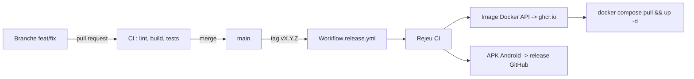

# Protocole de deploiement continu

## Vue d'ensemble



## Declencheur et etapes

Le deploiement est declenche par la pose d'un **tag de version** `vX.Y.Z` sur `main` (versionnement semantique). Le workflow `.github/workflows/release.yml` enchaine alors :

1. **Verification** : rejeu complet des controles de la CI (lint, build, 16 tests API ; analyse et 10 tests Flutter). Un echec interrompt la publication.
2. **Publication de l'API** : construction de l'image Docker multi-etapes (`apps/api/Dockerfile`, utilisateur non-root, healthcheck integre) et publication sur GitHub Container Registry sous deux tags : `ghcr.io/vincent-altmann/livearound-api:X.Y.Z` et `:latest`.
3. **Publication du mobile** : construction de l'APK de release (URL d'API injectee par la variable de depot `LIVEAROUND_API_BASE_URL`) et attachement a la release GitHub, avec notes generees.

## Mise en production

Le serveur applique la nouvelle version en deux commandes (voir [manuel-deploiement.md](manuel-deploiement.md)) :

```bash
docker compose -f docker-compose.prod.yml pull api
docker compose -f docker-compose.prod.yml up -d api
```

Les **migrations de schema s'executent automatiquement** au demarrage (versionnees, transactionnelles, idempotentes) : le deploiement ne comporte aucune etape manuelle de base de donnees.

## Securite et fiabilite du protocole

- Rien n'est publie sans CI verte (la verification fait partie du workflow de release).
- Les images sont **immuables et versionnees** : chaque version reste disponible, ce qui rend le retour arriere trivial (`LIVEAROUND_VERSION=<precedente> ... up -d`).
- Migrations additives uniquement au sein d'une version majeure → compatibilite descendante du schema, rollback sans perte.
- Les secrets de production (JWT, base, Ticketmaster) ne transitent jamais par le depot ni par le pipeline : ils vivent dans le `.env` du serveur.
- L'authentification au registre utilise le `GITHUB_TOKEN` ephemere du workflow (aucune cle personnelle).
