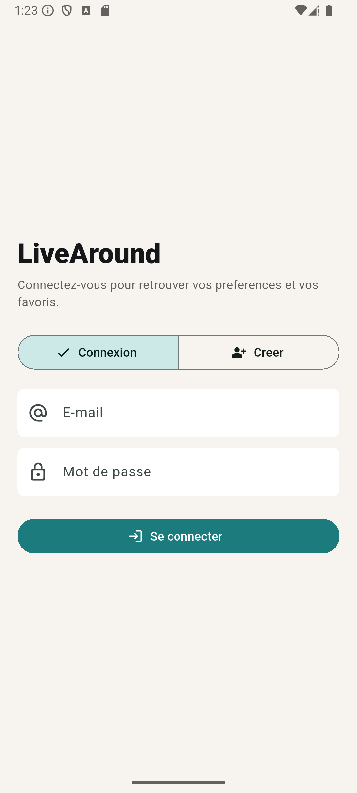
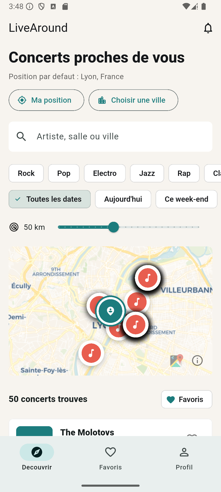
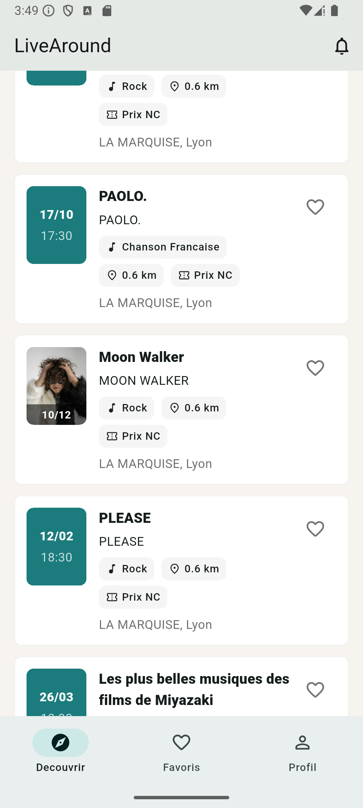
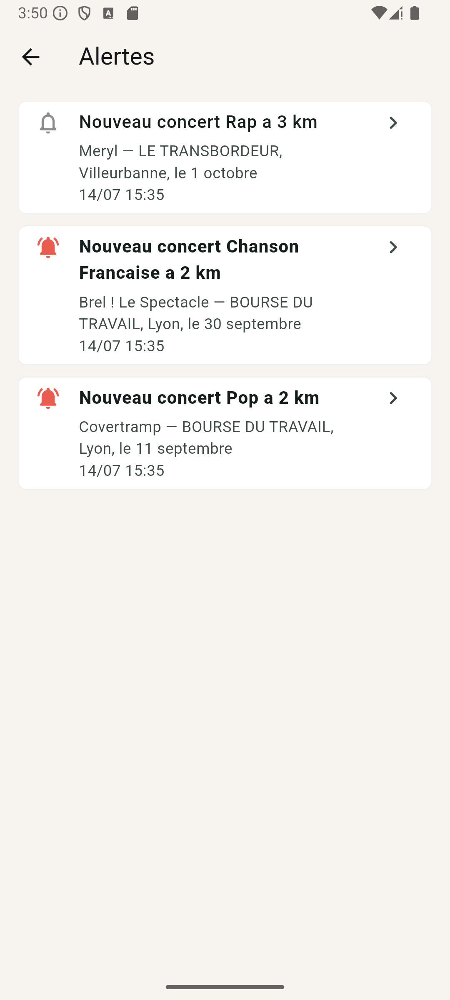
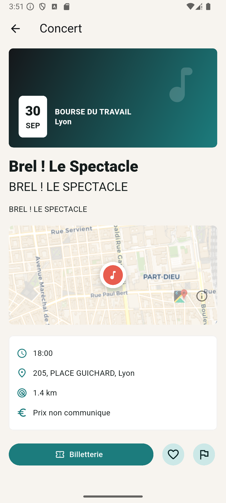

# Presentation du prototype

Prototype fonctionnel de LiveAround (version v0.3.0) sur emulateur Android, connecte a l'API NestJS locale, a la base PostGIS et a l'API Ticketmaster reelle : les concerts affiches ci-dessous sont de vrais evenements autour de Lyon.

## Parcours 1 — Connexion

Creation de compte ou connexion (session JWT conservee entre les lancements). Le lien « Mot de passe oublie ? » declenche le parcours de reinitialisation par code.

## Parcours 2 — Decouverte

L'ecran principal combine : position (GPS consenti ou ville choisie manuellement), recherche, filtres genre/date/rayon, carte interactive (reperes cliquables, position de l'utilisateur) et compteur de resultats. Ici : 50 concerts reels dans un rayon de 50 km autour de Lyon.

La liste presente chaque concert avec la photo de l'artiste quand Ticketmaster la fournit (date en surimpression), le genre, la distance, le prix (« Prix NC » si inconnu) et la salle. Elle se complete automatiquement au defilement (pages de 50).

## Parcours 3 — Alertes personnalisees

Trois alertes generees par le pipeline reel (nouveaux concerts correspondant aux preferences, a moins de 3 km de la derniere position de recherche), plafonnees a 3/jour. L'etat lu/non lu est visible ; toucher une alerte ouvre la fiche et historise le clic.

## Parcours 4 — Fiche concert

Fiche « Brel ! Le Spectacle » ouverte depuis une alerte : date, salle geolocalisee, distance, prix, acces billetterie officiel, mise en favori et signalement d'une donnee incorrecte.

## Ce que le prototype demontre

- l'integration reelle de la chaine complete : mobile → API → PostGIS → Ticketmaster ;
- la personnalisation (preferences appliquees a la decouverte et aux alertes) ;
- la resilience (repli cache PostGIS verifie en coupant Ticketmaster) ;
- le socle de securite (sessions JWT/refresh, comptes proteges).

Reproduire la demonstration : [developpement.md](developpement.md) (environnement local) ou `flutter run --dart-define LIVEAROUND_DEMO_MODE=true` pour une version autonome sur donnees de demonstration, sans API.
